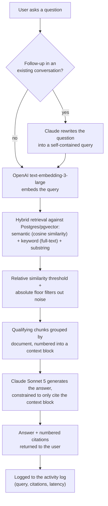

# ProdZen Compass

**An internal RAG knowledge assistant that lets a consulting firm's team search and ask questions across its entire document library — grounded, cited, and honest about what it doesn't know.**

## Why this exists

At a consulting firm, institutional knowledge lives in hundreds of scattered files — market research decks, client transcripts, financial summaries, compliance memos — findable only if you already remember the filename or which folder it's buried in. A new market-entry question that was already answered for a similar client six months ago gets re-researched from scratch, because there's no way to ask "have we seen this before?" across the whole corpus at once.

ProdZen Compass is a working prototype of that missing layer: upload the documents once, then either search them like a real search engine (with filters, not just filename matching) or ask a question in plain language and get a synthesized, cited answer pulled only from what the firm actually has on file.

## My role and process

I'm a non-technical product manager. I scoped, built, and shipped this application myself, end to end, using **Claude Code** as the development tool — there was no separate engineering team.

The process I applied was still a product management process, not a "prompt and hope" one:

- **AI use-case evaluation and risk scoring** before committing to the RAG approach, weighing where an LLM adds real leverage (synthesizing across scattered documents) against where it's a liability (fabricating answers with no source) — which directly shaped the grounding and refusal rules described below.
- **PRD-driven scoping**, turning "search should be better" into concrete, testable requirements (hybrid retrieval behavior, required vs. optional metadata fields, citation format, file-type coverage) rather than leaving them implicit.
- **A golden-query evaluation methodology** — a fixed set of ground-truth queries with known-relevant documents (see [`scripts/benchmark-retrieval.mjs`](scripts/benchmark-retrieval.mjs)), used to measure retrieval quality objectively and catch regressions when the retrieval pipeline changed (e.g. the embedding model migration documented in [`src/lib/retrieval.js`](src/lib/retrieval.js)).
- **UX validation against Microsoft's Human-AI Guidelines and AI UX Principles** — concretely, this is why the Ask experience always shows its sources, why the assistant is designed to say "I don't have enough information" instead of guessing, and why search results are transparent, filterable, and never a black box.

## Architecture

**Frontend:** Next.js 16 (App Router) + React 19, single-page tab layout (Search / Ask / Upload) with state lifted into one root component — no separate state library, no CSS framework (plain inline styles).

**Backend:** Next.js API routes running as Vercel serverless functions — no separate backend service.

**Database:** Supabase Postgres with `pgvector`, storing embeddings as `halfvec(3072)` behind an HNSW index for fast approximate nearest-neighbor search, alongside plain relational tables for documents, chunks, and activity logging.

**Embedding model:** OpenAI `text-embedding-3-large` ([`src/lib/retrieval.js`](src/lib/retrieval.js), [`src/app/api/upload/route.js`](src/app/api/upload/route.js)).

**Generation model:** Claude Sonnet 5 (`claude-sonnet-5`) via the Anthropic SDK ([`src/app/api/ask/route.js`](src/app/api/ask/route.js)).

**Hosting:** Vercel (app) + Supabase (database, storage, auth-free service role access).

### Query flow (Ask)

Search follows the same hybrid retrieval and threshold logic minus the rewrite/generation steps — it returns ranked, filterable documents directly rather than a synthesized answer.

## How it earns trust

A generic RAG demo answers confidently regardless of whether it actually knows. This one is deliberately built not to, via rules enforced in the system prompt ([`src/app/api/ask/route.js`](src/app/api/ask/route.js)):

- **Strict grounding.** The model is instructed to answer *only* from the numbered context block retrieved for that specific turn — never from outside/general knowledge, and never from a previous turn's retrieved context bleeding into a new, unrelated question.
- **Honest refusal.** When the retrieved context doesn't actually support an answer, the model is instructed to say so plainly ("I don't have enough information in the knowledge base to answer that") with no citation markers attached — it doesn't fabricate a citation to look more confident than the underlying evidence supports.
- **Resistance to prompt injection embedded in documents.** Retrieved document content is explicitly framed to the model as untrusted data, not instructions: if a chunk of retrieved text contains something that reads like a command, the system prompt directs the model to treat it purely as content to cite, never as something to obey. This matters specifically because the documents in this system are uploaded by end users, not curated by developers — the model has to stay skeptical of its own retrieved context by design, not by accident.

## Results

Measured with the golden-query benchmark in [`scripts/benchmark-retrieval.mjs`](scripts/benchmark-retrieval.mjs) — 10 fixed ground-truth queries (9 real + 1 deliberate negative control) run against the live retrieval pipeline:

| Metric | Value | Source |
|---|---|---|
| Mean Reciprocal Rank (9 real queries) | **0.944** | `scripts/benchmark-retrieval.mjs`, run live against current corpus |
| Mean Reciprocal Rank (incl. negative control) | 0.850 | same |
| Average precision (9 real queries) | ~0.71 | same |
| Average recall (9 real queries) | ~0.97 | same |

One result worth calling out specifically: a query for "financial statement" correctly surfaced a quarterly financial summary document with **zero literal phrase overlap** in its body text — found purely through semantic similarity, which is the concrete case for why embedding-based retrieval earns its complexity over keyword search alone.

*(An acceptance-test pass rate isn't included here — there's no automated acceptance-test suite committed to this repo, and I didn't want to cite a number I couldn't verify against the current code.)*

## Known limitations

- **Retrieval precision is uneven across query types.** Broad or ambiguous queries (e.g. a bare acronym with multiple loosely-related documents) pull in more noise than narrow, specific ones — average precision (~0.71) trails average recall (~0.97) in the benchmark above.
- **The relevance threshold isn't perfectly tuned for every case.** The negative-control query in the benchmark ("UAE real estate," which matches nothing on purpose) still returned two false positives. This is a documented, deliberately-accepted trade-off ([`src/lib/retrieval.js`](src/lib/retrieval.js)): the threshold is tuned as a single global setting across very different query shapes, and no single fixed threshold cleanly separates every relevant result from every irrelevant one without also cutting into legitimate matches elsewhere.
- **No authentication or per-user access control.** This is a single shared corpus with no login — appropriate for a prototype/internal-beta scope, not yet for multi-tenant or access-restricted use.
- **No automated acceptance-test suite.** Verification has so far been manual and scenario-driven (including live browser-based checks) rather than a committed, repeatable test suite.
- **Citation highlighting is best-effort for PDF/DOCX only.** Other file formats link to the raw file rather than an in-document highlighted passage.

## What's next

- Move from a single global relevance threshold toward query-adaptive or multi-signal ranking, to close the precision gap on broad/ambiguous queries without regressing narrow ones.
- Add a lightweight automated acceptance-test suite on top of the existing golden-query benchmark, so retrieval and generation quality are checked on every change, not just measured on demand.
- Introduce basic authentication and per-client access scoping, so the tool can hold more than one firm's worth of confidential documents at once.
- Expand in-document citation highlighting beyond PDF/DOCX to the rest of the supported file types.

---

*Built by Saisudha Shenoy, product manager, using [Claude Code](https://claude.com/claude-code) as the sole development tool.*
